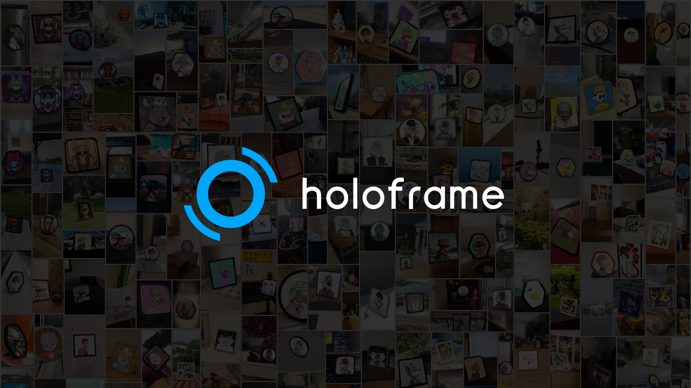

# Holoframe

_**AR tool for viewing NFTs in augmented reality**_

[](https://holoframe.io)

View any NFT from OpenSea in AR on your mobile device. Use it directly at [holoframe.io](https://holoframe.io) or embed AR widgets on your own website.

_This repository contains the open-source code for Holoframe's embeddable widgets. Built by [Belter Labs](https://belterlabs.com/)._


## Two Ways to Use Holoframe

### 1. Direct Viewing at holoframe.io
Visit [holoframe.io](https://holoframe.io) to view any NFT in AR - no coding required.

### 2. Embed on Your Website
Add customizable NFT AR widgets to your own site. This repository contains the code and documentation for embedding Holoframe widgets.

## Widget Features

- 🎨 **Customizable 3D frames** - Choose colors, shapes, metalness, and roughness
- 📱 **Cross-platform AR** - Works on iOS (Quick Look), Android (WebXR), and modern browsers
- 🔗 **Two widget types** - Collection-specific (one per page) or universal (multiple per page)
- ⚡ **No build step required** - Pure client-side with CDN dependencies
- 🎯 **Easy integration** - Drop in a few lines of code
- 🌐 **22+ blockchain support** - Ethereum, Polygon, Base, Arbitrum, and more
- 🔢 **Multi-instance support** - Universal widget supports multiple instances per page

## Quick Start

### Option 1: Use Widget Builder (Collection Widgets Only)

The easiest way to create a collection-specific widget:

1. Go to [holoframe.io](https://holoframe.io)
2. Use the Widget Builder
3. Copy the generated code
4. Paste into your website

### Option 2: Manual Integration

#### Collection-Specific Widget

**One widget per page** - for a single NFT collection where users enter token IDs:

```html
<div id="hf-widget"></div>
<script>
window.hfWidgetConfig = {
  collection: "pudgypenguins",
  contract: "0xBd3531dA5CF5857e7CfAA92426877b022e612cf8",
  chain: "ethereum",
  brandColor: "#00a6fb",
  displayMode: "button-input",
  theme: "light"
};

fetch('https://cdn.jsdelivr.net/gh/Belter-Labs/holoframe@main/src/hf-widget.js')
  .then(r => r.text())
  .then(code => eval(code))
  .catch(e => console.error('HF Widget load error:', e));
</script>
```

#### Universal Widget (Single Instance)

View **any NFT from OpenSea** - users paste OpenSea URLs:

```html
<div id="hf-widget"></div>
<script>
window.hfWidgetConfig = {
  brandColor: "#00a6fb",
  displayMode: "button-input",
  theme: "light"
};

fetch('https://cdn.jsdelivr.net/gh/Belter-Labs/holoframe@main/src/hf-core.js')
  .then(r => r.text())
  .then(code => eval(code))
  .catch(e => console.error('HF Widget load error:', e));
</script>
```

#### Universal Widget (Multiple Instances)

**Multiple widgets per page** - each with different settings:

```html
<div id="hf-widget-1"></div>
<div id="hf-widget-2"></div>

<script>
window.hfWidgets = [
  {
    containerId: 'hf-widget-1',
    brandColor: '#00a6fb',
    displayMode: 'button-only',
    theme: 'light'
  },
  {
    containerId: 'hf-widget-2',
    brandColor: '#7c3aed',
    displayMode: 'button-input',
    theme: 'dark'
  }
];

fetch('https://cdn.jsdelivr.net/gh/Belter-Labs/holoframe@main/src/hf-core.js')
  .then(r => r.text())
  .then(code => eval(code));
</script>
```

## Documentation

- [Setup Guide](docs/SETUP.md) - Complete installation and configuration
- [How It Works](docs/HOW_IT_WORKS.md) - Technical architecture
- [Examples](examples/) - Working code examples

**Widget Builder:** Available at [holoframe.io](https://holoframe.io) for no-code widget creation

## How Holoframe Works

**Holoframe** is an AR tool for viewing NFTs. It has two parts:

1. **Main App** ([holoframe.io](https://holoframe.io)) - View any NFT directly in AR
2. **Embeddable Widgets** (this repo) - Add AR NFT viewing to your own website

### Widget Architecture

Widgets use a pre-built 3D frame (GLB file hosted on Cloudinary) and dynamically apply NFT textures:

1. **Widget loads base GLB** - Pre-made 3D frame from Cloudinary
2. **Fetches NFT image** - From OpenSea via Cloudflare Worker proxy
3. **model-viewer applies texture** - Swaps texture onto frame + applies color/metalness/roughness
4. **AR ready** - Users can view on mobile devices via WebXR/Quick Look/Scene Viewer

No client-side 3D generation - just texture swapping and material property updates on a pre-existing model.

## Supported Blockchains

Ethereum • Polygon • Arbitrum • Optimism • Avalanche • Zora • Base • Blast • Sei • B3 • Berachain • Flow • ApeChain • Soneium • Shape • Unichain • Ronin • Abstract • GUNZ • HyperEVM • Somnia • Monad

**Chain names:** Use lowercase (e.g., `ethereum`, `polygon`, `base`)

## Roadmap

Potential future features being considered:

- **GLB Export** - Allow users to download the 3D model with their NFT texture applied
- **PBR Frame Textures** - Support for custom physically-based rendering textures on frames
- **Collection Multi-widget** - Multiple collection widgets per page (universal already supports this)
- **Custom Frame Shapes** - User-uploaded frame geometries

*Have a feature request? [Open an issue](https://github.com/Belter-Labs/holoframe/issues)*

## Widget Builder

Use the [Widget Builder](docs/WIDGET_BUILDER.md) to generate custom embed code through a simple UI:

```html
<!-- Include the Widget Builder on your site -->
<link rel="stylesheet" href="src/builder/builder.css">
<div id="hfwb-root"></div>
<script src="src/builder/builder.html"></script>
<script src="src/builder/builder.js"></script>
```

## Examples

- [Basic Collection Widget](examples/basic-collection.html)
- [Universal Viewer](examples/universal-viewer.html)
- [Custom Styling](examples/custom-styling.html)
- [Dark Theme](examples/dark-theme.html)

## Development

```bash
# Clone the repository
git clone https://github.com/Belter-Labs/holoframe.git
cd holoframe

# Widget files are in src/
# - src/hf-widget.js (Collection widget)
# - src/hf-core.js (Universal widget)

# Edit the files directly, then commit and push
# Users will automatically get the latest version from:
# https://cdn.jsdelivr.net/gh/Belter-Labs/holoframe@main/src/hf-widget.js
# https://cdn.jsdelivr.net/gh/Belter-Labs/holoframe@main/src/hf-core.js
```

## Attribution

Holoframe is open-source and free to use. The only requirement is keeping the "Powered by Holoframe" attribution link visible in the widget.

## License

MIT License - see [LICENSE](LICENSE) for details.

## Built By

[Belter Labs](https://belterlabs.com/) 

**Note:** We are not accepting pull requests. However, you're free to fork and build your own version!

## Links

- **Website**: [holoframe.io](https://holoframe.io)
- **Documentation**: [docs/](docs/)
- **Widget Files**: [src/](src/)
- **Issues**: [GitHub Issues](https://github.com/Belter-Labs/holoframe/issues)
- **Twitter**: [@BelterLabs](https://twitter.com/BelterLabs)

---

**Note**: Holoframe uses OpenSea's API to fetch NFT metadata. Rate limits apply (100 requests/hour per IP for NFT data, 20/hour for collection validation).
